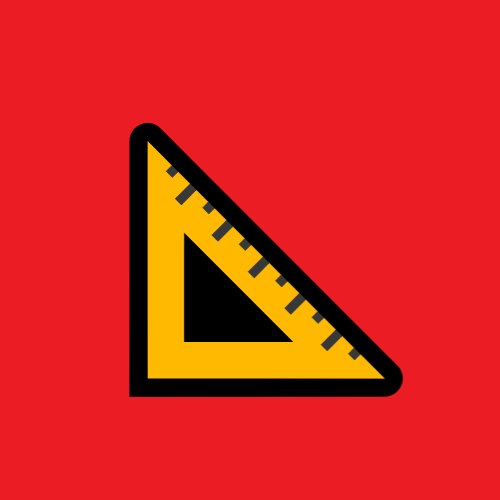

<h1 align="center"><b>Angularization</b></h1>
 

  

 
<h3 align="center">Thorough documentation for getting started with <b>Angular 11</b>.</h3>
 

 

## **Sections**
### **"NVM not NPM" ❓**
* Why "NVM"?
* How to Install NVM
* How to Use NVM
### **Visual Studio Code 🟦**
* Integrated Terminal
* System Administrator Permissions
* Extensions
* Add Terminals
* Delete Terminals
* Edit Default Terminal
* Bonus: Zen Mode
### **Angular 11 🔥**
* How to install Angular CLI
* How to generate a new app
* How to serve a new app
* `app.component`: HTML, SCSS, & TypeScript
* `app.module`
* `package.json`
* NPM Scripting: Create New Script
* NPM Scripting: Update `start`
* NPM Scripting: CI/CD Power 💪
* `npm generate component <component-name>`
* Angular**DRY**: Don't. Repeat. Yourself.
* `*ng`X: Structural Directives
* Unidirectional Data Flow: `ParentComponent` <b>→</b> `ChildComponent`
 
 
<h3 align="center"><b>Section Tutorials Coming Soon</b></h3>
 
 

 
 